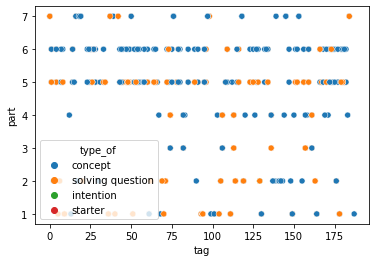
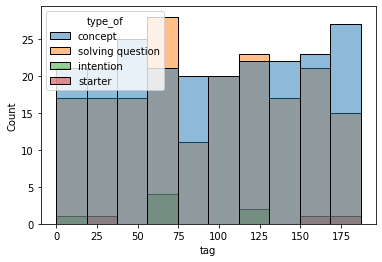
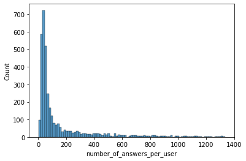
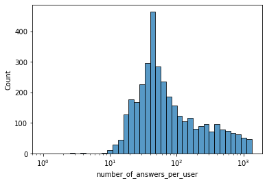
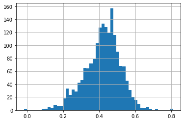
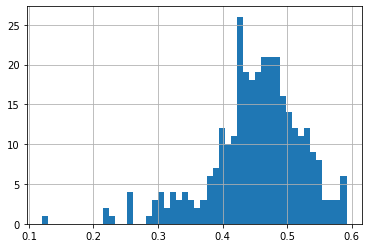
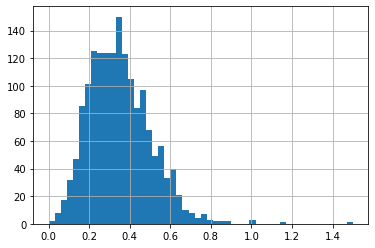

```python
import numpy as np 
import pandas as pd
import seaborn as sns
```


```python
df = pd.read_csv(r"C:\Users\AKochurov\Downloads\questions.csv")
```


```python
df.info()
```

    <class 'pandas.core.frame.DataFrame'>
    RangeIndex: 13523 entries, 0 to 13522
    Data columns (total 5 columns):
     #   Column          Non-Null Count  Dtype 
    ---  ------          --------------  ----- 
     0   question_id     13523 non-null  int64 
     1   bundle_id       13523 non-null  int64 
     2   correct_answer  13523 non-null  int64 
     3   part            13523 non-null  int64 
     4   tags            13522 non-null  object
    dtypes: int64(4), object(1)
    memory usage: 528.4+ KB
    


```python
df1 = pd.read_csv(r"C:\Users\AKochurov\Downloads\train.csv.zip", nrows = 1000000)
```


```python
df1.info()
```

    <class 'pandas.core.frame.DataFrame'>
    RangeIndex: 1000000 entries, 0 to 999999
    Data columns (total 10 columns):
     #   Column                          Non-Null Count    Dtype  
    ---  ------                          --------------    -----  
     0   row_id                          1000000 non-null  int64  
     1   timestamp                       1000000 non-null  int64  
     2   user_id                         1000000 non-null  int64  
     3   content_id                      1000000 non-null  int64  
     4   content_type_id                 1000000 non-null  int64  
     5   task_container_id               1000000 non-null  int64  
     6   user_answer                     1000000 non-null  int64  
     7   answered_correctly              1000000 non-null  int64  
     8   prior_question_elapsed_time     976277 non-null   float64
     9   prior_question_had_explanation  996184 non-null   object 
    dtypes: float64(1), int64(8), object(1)
    memory usage: 76.3+ MB
    


```python
df2 = pd.read_csv(r"C:\Users\AKochurov\Downloads\lectures.csv")
```


```python
df2.info()
```

    <class 'pandas.core.frame.DataFrame'>
    RangeIndex: 418 entries, 0 to 417
    Data columns (total 4 columns):
     #   Column      Non-Null Count  Dtype 
    ---  ------      --------------  ----- 
     0   lecture_id  418 non-null    int64 
     1   tag         418 non-null    int64 
     2   part        418 non-null    int64 
     3   type_of     418 non-null    object
    dtypes: int64(3), object(1)
    memory usage: 13.2+ KB
    


```python
df.head()
```


<div>
<style scoped>
    .dataframe tbody tr th:only-of-type {
        vertical-align: middle;
    }

    .dataframe tbody tr th {
        vertical-align: top;
    }

    .dataframe thead th {
        text-align: right;
    }
</style>
<table border="1" class="dataframe">
  <thead>
    <tr style="text-align: right;">
      <th></th>
      <th>question_id</th>
      <th>bundle_id</th>
      <th>correct_answer</th>
      <th>part</th>
      <th>tags</th>
    </tr>
  </thead>
  <tbody>
    <tr>
      <th>0</th>
      <td>0</td>
      <td>0</td>
      <td>0</td>
      <td>1</td>
      <td>51 131 162 38</td>
    </tr>
    <tr>
      <th>1</th>
      <td>1</td>
      <td>1</td>
      <td>1</td>
      <td>1</td>
      <td>131 36 81</td>
    </tr>
    <tr>
      <th>2</th>
      <td>2</td>
      <td>2</td>
      <td>0</td>
      <td>1</td>
      <td>131 101 162 92</td>
    </tr>
    <tr>
      <th>3</th>
      <td>3</td>
      <td>3</td>
      <td>0</td>
      <td>1</td>
      <td>131 149 162 29</td>
    </tr>
    <tr>
      <th>4</th>
      <td>4</td>
      <td>4</td>
      <td>3</td>
      <td>1</td>
      <td>131 5 162 38</td>
    </tr>
  </tbody>
</table>
</div>


```python
df1.head()
```


<div>
<style scoped>
    .dataframe tbody tr th:only-of-type {
        vertical-align: middle;
    }

    .dataframe tbody tr th {
        vertical-align: top;
    }

    .dataframe thead th {
        text-align: right;
    }
</style>
<table border="1" class="dataframe">
  <thead>
    <tr style="text-align: right;">
      <th></th>
      <th>row_id</th>
      <th>timestamp</th>
      <th>user_id</th>
      <th>content_id</th>
      <th>content_type_id</th>
      <th>task_container_id</th>
      <th>user_answer</th>
      <th>answered_correctly</th>
      <th>prior_question_elapsed_time</th>
      <th>prior_question_had_explanation</th>
    </tr>
  </thead>
  <tbody>
    <tr>
      <th>0</th>
      <td>0</td>
      <td>0</td>
      <td>115</td>
      <td>5692</td>
      <td>0</td>
      <td>1</td>
      <td>3</td>
      <td>1</td>
      <td>NaN</td>
      <td>NaN</td>
    </tr>
    <tr>
      <th>1</th>
      <td>1</td>
      <td>56943</td>
      <td>115</td>
      <td>5716</td>
      <td>0</td>
      <td>2</td>
      <td>2</td>
      <td>1</td>
      <td>37000.0</td>
      <td>False</td>
    </tr>
    <tr>
      <th>2</th>
      <td>2</td>
      <td>118363</td>
      <td>115</td>
      <td>128</td>
      <td>0</td>
      <td>0</td>
      <td>0</td>
      <td>1</td>
      <td>55000.0</td>
      <td>False</td>
    </tr>
    <tr>
      <th>3</th>
      <td>3</td>
      <td>131167</td>
      <td>115</td>
      <td>7860</td>
      <td>0</td>
      <td>3</td>
      <td>0</td>
      <td>1</td>
      <td>19000.0</td>
      <td>False</td>
    </tr>
    <tr>
      <th>4</th>
      <td>4</td>
      <td>137965</td>
      <td>115</td>
      <td>7922</td>
      <td>0</td>
      <td>4</td>
      <td>1</td>
      <td>1</td>
      <td>11000.0</td>
      <td>False</td>
    </tr>
  </tbody>
</table>
</div>


```python
df2.head()
```


<div>
<style scoped>
    .dataframe tbody tr th:only-of-type {
        vertical-align: middle;
    }

    .dataframe tbody tr th {
        vertical-align: top;
    }

    .dataframe thead th {
        text-align: right;
    }
</style>
<table border="1" class="dataframe">
  <thead>
    <tr style="text-align: right;">
      <th></th>
      <th>lecture_id</th>
      <th>tag</th>
      <th>part</th>
      <th>type_of</th>
    </tr>
  </thead>
  <tbody>
    <tr>
      <th>0</th>
      <td>89</td>
      <td>159</td>
      <td>5</td>
      <td>concept</td>
    </tr>
    <tr>
      <th>1</th>
      <td>100</td>
      <td>70</td>
      <td>1</td>
      <td>concept</td>
    </tr>
    <tr>
      <th>2</th>
      <td>185</td>
      <td>45</td>
      <td>6</td>
      <td>concept</td>
    </tr>
    <tr>
      <th>3</th>
      <td>192</td>
      <td>79</td>
      <td>5</td>
      <td>solving question</td>
    </tr>
    <tr>
      <th>4</th>
      <td>317</td>
      <td>156</td>
      <td>5</td>
      <td>solving question</td>
    </tr>
  </tbody>
</table>
</div>


```python
df.describe()
```


<div>
<style scoped>
    .dataframe tbody tr th:only-of-type {
        vertical-align: middle;
    }

    .dataframe tbody tr th {
        vertical-align: top;
    }

    .dataframe thead th {
        text-align: right;
    }
</style>
<table border="1" class="dataframe">
  <thead>
    <tr style="text-align: right;">
      <th></th>
      <th>question_id</th>
      <th>bundle_id</th>
      <th>correct_answer</th>
      <th>part</th>
    </tr>
  </thead>
  <tbody>
    <tr>
      <th>count</th>
      <td>13523.00000</td>
      <td>13523.000000</td>
      <td>13523.000000</td>
      <td>13523.000000</td>
    </tr>
    <tr>
      <th>mean</th>
      <td>6761.00000</td>
      <td>6760.510907</td>
      <td>1.455298</td>
      <td>4.264956</td>
    </tr>
    <tr>
      <th>std</th>
      <td>3903.89818</td>
      <td>3903.857783</td>
      <td>1.149707</td>
      <td>1.652553</td>
    </tr>
    <tr>
      <th>min</th>
      <td>0.00000</td>
      <td>0.000000</td>
      <td>0.000000</td>
      <td>1.000000</td>
    </tr>
    <tr>
      <th>25%</th>
      <td>3380.50000</td>
      <td>3379.500000</td>
      <td>0.000000</td>
      <td>3.000000</td>
    </tr>
    <tr>
      <th>50%</th>
      <td>6761.00000</td>
      <td>6761.000000</td>
      <td>1.000000</td>
      <td>5.000000</td>
    </tr>
    <tr>
      <th>75%</th>
      <td>10141.50000</td>
      <td>10140.000000</td>
      <td>3.000000</td>
      <td>5.000000</td>
    </tr>
    <tr>
      <th>max</th>
      <td>13522.00000</td>
      <td>13522.000000</td>
      <td>3.000000</td>
      <td>7.000000</td>
    </tr>
  </tbody>
</table>
</div>


```python
df1.describe()
```


<div>
<style scoped>
    .dataframe tbody tr th:only-of-type {
        vertical-align: middle;
    }

    .dataframe tbody tr th {
        vertical-align: top;
    }

    .dataframe thead th {
        text-align: right;
    }
</style>
<table border="1" class="dataframe">
  <thead>
    <tr style="text-align: right;">
      <th></th>
      <th>row_id</th>
      <th>timestamp</th>
      <th>user_id</th>
      <th>content_id</th>
      <th>content_type_id</th>
      <th>task_container_id</th>
      <th>user_answer</th>
      <th>answered_correctly</th>
      <th>prior_question_elapsed_time</th>
    </tr>
  </thead>
  <tbody>
    <tr>
      <th>count</th>
      <td>1000000.000000</td>
      <td>1.000000e+06</td>
      <td>1.000000e+06</td>
      <td>1000000.000000</td>
      <td>1000000.000000</td>
      <td>1000000.000000</td>
      <td>1000000.000000</td>
      <td>1000000.000000</td>
      <td>976277.000000</td>
    </tr>
    <tr>
      <th>mean</th>
      <td>499999.500000</td>
      <td>7.344311e+09</td>
      <td>1.017255e+07</td>
      <td>5232.691523</td>
      <td>0.019907</td>
      <td>806.105689</td>
      <td>1.374784</td>
      <td>0.617504</td>
      <td>25302.962693</td>
    </tr>
    <tr>
      <th>std</th>
      <td>288675.278933</td>
      <td>1.058693e+10</td>
      <td>6.029234e+06</td>
      <td>3882.323419</td>
      <td>0.139681</td>
      <td>1025.887530</td>
      <td>1.194168</td>
      <td>0.525364</td>
      <td>19710.310227</td>
    </tr>
    <tr>
      <th>min</th>
      <td>0.000000</td>
      <td>0.000000e+00</td>
      <td>1.150000e+02</td>
      <td>0.000000</td>
      <td>0.000000</td>
      <td>0.000000</td>
      <td>-1.000000</td>
      <td>-1.000000</td>
      <td>0.000000</td>
    </tr>
    <tr>
      <th>25%</th>
      <td>249999.750000</td>
      <td>5.211669e+08</td>
      <td>4.702585e+06</td>
      <td>2057.000000</td>
      <td>0.000000</td>
      <td>109.000000</td>
      <td>0.000000</td>
      <td>0.000000</td>
      <td>16000.000000</td>
    </tr>
    <tr>
      <th>50%</th>
      <td>499999.500000</td>
      <td>2.824811e+09</td>
      <td>9.678259e+06</td>
      <td>5052.000000</td>
      <td>0.000000</td>
      <td>391.000000</td>
      <td>1.000000</td>
      <td>1.000000</td>
      <td>21000.000000</td>
    </tr>
    <tr>
      <th>75%</th>
      <td>749999.250000</td>
      <td>1.010186e+10</td>
      <td>1.556872e+07</td>
      <td>7421.000000</td>
      <td>0.000000</td>
      <td>1112.000000</td>
      <td>3.000000</td>
      <td>1.000000</td>
      <td>29666.000000</td>
    </tr>
    <tr>
      <th>max</th>
      <td>999999.000000</td>
      <td>7.809200e+10</td>
      <td>2.094902e+07</td>
      <td>32736.000000</td>
      <td>1.000000</td>
      <td>7739.000000</td>
      <td>3.000000</td>
      <td>1.000000</td>
      <td>300000.000000</td>
    </tr>
  </tbody>
</table>
</div>


```python
df2.describe()
```


<div>
<style scoped>
    .dataframe tbody tr th:only-of-type {
        vertical-align: middle;
    }

    .dataframe tbody tr th {
        vertical-align: top;
    }

    .dataframe thead th {
        text-align: right;
    }
</style>
<table border="1" class="dataframe">
  <thead>
    <tr style="text-align: right;">
      <th></th>
      <th>lecture_id</th>
      <th>tag</th>
      <th>part</th>
    </tr>
  </thead>
  <tbody>
    <tr>
      <th>count</th>
      <td>418.000000</td>
      <td>418.000000</td>
      <td>418.000000</td>
    </tr>
    <tr>
      <th>mean</th>
      <td>16983.401914</td>
      <td>94.480861</td>
      <td>4.267943</td>
    </tr>
    <tr>
      <th>std</th>
      <td>9426.164660</td>
      <td>53.586487</td>
      <td>1.872424</td>
    </tr>
    <tr>
      <th>min</th>
      <td>89.000000</td>
      <td>0.000000</td>
      <td>1.000000</td>
    </tr>
    <tr>
      <th>25%</th>
      <td>9026.250000</td>
      <td>50.250000</td>
      <td>2.000000</td>
    </tr>
    <tr>
      <th>50%</th>
      <td>17161.500000</td>
      <td>94.500000</td>
      <td>5.000000</td>
    </tr>
    <tr>
      <th>75%</th>
      <td>24906.250000</td>
      <td>140.000000</td>
      <td>6.000000</td>
    </tr>
    <tr>
      <th>max</th>
      <td>32736.000000</td>
      <td>187.000000</td>
      <td>7.000000</td>
    </tr>
  </tbody>
</table>
</div>


```python
df.shape
```


    (13523, 5)


```python
df1.shape
```


    (1000000, 10)


```python
df2.shape
```


    (418, 4)


```python
df.isna().sum()
```


    question_id       0
    bundle_id         0
    correct_answer    0
    part              0
    tags              1
    dtype: int64


```python
df1.isna().sum()
```


    row_id                                0
    timestamp                             0
    user_id                               0
    content_id                            0
    content_type_id                       0
    task_container_id                     0
    user_answer                           0
    answered_correctly                    0
    prior_question_elapsed_time       23723
    prior_question_had_explanation     3816
    dtype: int64


```python
df2.isna().sum()
```


    lecture_id    0
    tag           0
    part          0
    type_of       0
    dtype: int64


```python
df2[['type_of','part','lecture_id']].groupby(['type_of','part'], as_index = False).count().sort_values(by=['type_of', 'part'])
```


<div>
<style scoped>
    .dataframe tbody tr th:only-of-type {
        vertical-align: middle;
    }

    .dataframe tbody tr th {
        vertical-align: top;
    }

    .dataframe thead th {
        text-align: right;
    }
</style>
<table border="1" class="dataframe">
  <thead>
    <tr style="text-align: right;">
      <th></th>
      <th>type_of</th>
      <th>part</th>
      <th>lecture_id</th>
    </tr>
  </thead>
  <tbody>
    <tr>
      <th>0</th>
      <td>concept</td>
      <td>1</td>
      <td>20</td>
    </tr>
    <tr>
      <th>1</th>
      <td>concept</td>
      <td>2</td>
      <td>18</td>
    </tr>
    <tr>
      <th>2</th>
      <td>concept</td>
      <td>3</td>
      <td>7</td>
    </tr>
    <tr>
      <th>3</th>
      <td>concept</td>
      <td>4</td>
      <td>19</td>
    </tr>
    <tr>
      <th>4</th>
      <td>concept</td>
      <td>5</td>
      <td>72</td>
    </tr>
    <tr>
      <th>5</th>
      <td>concept</td>
      <td>6</td>
      <td>63</td>
    </tr>
    <tr>
      <th>6</th>
      <td>concept</td>
      <td>7</td>
      <td>23</td>
    </tr>
    <tr>
      <th>7</th>
      <td>intention</td>
      <td>2</td>
      <td>7</td>
    </tr>
    <tr>
      <th>8</th>
      <td>solving question</td>
      <td>1</td>
      <td>34</td>
    </tr>
    <tr>
      <th>9</th>
      <td>solving question</td>
      <td>2</td>
      <td>31</td>
    </tr>
    <tr>
      <th>10</th>
      <td>solving question</td>
      <td>3</td>
      <td>12</td>
    </tr>
    <tr>
      <th>11</th>
      <td>solving question</td>
      <td>4</td>
      <td>12</td>
    </tr>
    <tr>
      <th>12</th>
      <td>solving question</td>
      <td>5</td>
      <td>69</td>
    </tr>
    <tr>
      <th>13</th>
      <td>solving question</td>
      <td>6</td>
      <td>19</td>
    </tr>
    <tr>
      <th>14</th>
      <td>solving question</td>
      <td>7</td>
      <td>9</td>
    </tr>
    <tr>
      <th>15</th>
      <td>starter</td>
      <td>5</td>
      <td>2</td>
    </tr>
    <tr>
      <th>16</th>
      <td>starter</td>
      <td>6</td>
      <td>1</td>
    </tr>
  </tbody>
</table>
</div>


```python
sns.scatterplot(data = df2, x = 'tag', y = 'part', hue = 'type_of')
```


    <AxesSubplot:xlabel='tag', ylabel='part'>


    

    


```python
sns.histplot(data=df2,x='tag', hue = 'type_of')
```


    <AxesSubplot:xlabel='tag', ylabel='Count'>


    

    


```python
df1.agg({'user_id' : pd.Series.nunique})
```


    user_id    3824
    dtype: int64


```python
user_answer  = df1[['user_id', 'user_answer', 'answered_correctly']].groupby(['user_id'], as_index = False).sum()
```


```python
user_answer.describe()
```


<div>
<style scoped>
    .dataframe tbody tr th:only-of-type {
        vertical-align: middle;
    }

    .dataframe tbody tr th {
        vertical-align: top;
    }

    .dataframe thead th {
        text-align: right;
    }
</style>
<table border="1" class="dataframe">
  <thead>
    <tr style="text-align: right;">
      <th></th>
      <th>user_id</th>
      <th>user_answer</th>
      <th>answered_correctly</th>
    </tr>
  </thead>
  <tbody>
    <tr>
      <th>count</th>
      <td>3.824000e+03</td>
      <td>3824.000000</td>
      <td>3824.000000</td>
    </tr>
    <tr>
      <th>mean</th>
      <td>1.050633e+07</td>
      <td>359.514644</td>
      <td>161.481172</td>
    </tr>
    <tr>
      <th>std</th>
      <td>5.958653e+06</td>
      <td>984.492304</td>
      <td>457.802761</td>
    </tr>
    <tr>
      <th>min</th>
      <td>1.150000e+02</td>
      <td>1.000000</td>
      <td>-2.000000</td>
    </tr>
    <tr>
      <th>25%</th>
      <td>5.363199e+06</td>
      <td>38.000000</td>
      <td>11.000000</td>
    </tr>
    <tr>
      <th>50%</th>
      <td>1.061051e+07</td>
      <td>60.000000</td>
      <td>23.000000</td>
    </tr>
    <tr>
      <th>75%</th>
      <td>1.565077e+07</td>
      <td>219.000000</td>
      <td>94.000000</td>
    </tr>
    <tr>
      <th>max</th>
      <td>2.094902e+07</td>
      <td>16907.000000</td>
      <td>6103.000000</td>
    </tr>
  </tbody>
</table>
</div>


```python
user_answer.describe()
```


<div>
<style scoped>
    .dataframe tbody tr th:only-of-type {
        vertical-align: middle;
    }

    .dataframe tbody tr th {
        vertical-align: top;
    }

    .dataframe thead th {
        text-align: right;
    }
</style>
<table border="1" class="dataframe">
  <thead>
    <tr style="text-align: right;">
      <th></th>
      <th>user_id</th>
      <th>number_of_answers_per_user</th>
      <th>answered_correctly</th>
      <th>cor</th>
    </tr>
  </thead>
  <tbody>
    <tr>
      <th>count</th>
      <td>3.585000e+03</td>
      <td>3585.000000</td>
      <td>3585.000000</td>
      <td>3585.000000</td>
    </tr>
    <tr>
      <th>mean</th>
      <td>1.052197e+07</td>
      <td>159.402789</td>
      <td>68.483682</td>
      <td>0.383755</td>
    </tr>
    <tr>
      <th>std</th>
      <td>5.961041e+06</td>
      <td>238.836485</td>
      <td>111.890436</td>
      <td>0.131749</td>
    </tr>
    <tr>
      <th>min</th>
      <td>1.150000e+02</td>
      <td>1.000000</td>
      <td>-2.000000</td>
      <td>-0.017241</td>
    </tr>
    <tr>
      <th>25%</th>
      <td>5.386918e+06</td>
      <td>36.000000</td>
      <td>11.000000</td>
      <td>0.293103</td>
    </tr>
    <tr>
      <th>50%</th>
      <td>1.062930e+07</td>
      <td>55.000000</td>
      <td>21.000000</td>
      <td>0.392857</td>
    </tr>
    <tr>
      <th>75%</th>
      <td>1.568217e+07</td>
      <td>151.000000</td>
      <td>66.000000</td>
      <td>0.472603</td>
    </tr>
    <tr>
      <th>max</th>
      <td>2.094902e+07</td>
      <td>1335.000000</td>
      <td>759.000000</td>
      <td>1.500000</td>
    </tr>
  </tbody>
</table>
</div>


```python
user_answer.info()
```

    <class 'pandas.core.frame.DataFrame'>
    RangeIndex: 3824 entries, 0 to 3823
    Data columns (total 3 columns):
     #   Column              Non-Null Count  Dtype
    ---  ------              --------------  -----
     0   user_id             3824 non-null   int64
     1   user_answer         3824 non-null   int64
     2   answered_correctly  3824 non-null   int64
    dtypes: int64(3)
    memory usage: 89.8 KB
    


```python
def remove_outliers(df,col,n_std):
        mean = df[col].mean()
        sd = df[col].std()
        
        df = df[(df[col] <= mean+(n_std*sd))]
        
        return df

user_answer = remove_outliers(user_answer, 'user_answer', 1)

user_answer['cor'] = user_answer['answered_correctly']/user_answer['user_answer']
user_answer.rename(columns={'user_answer':'number_of_answers_per_user'}, inplace=True)
user_answer.describe()
# разброс очень большой, сокращаем его
```


<div>
<style scoped>
    .dataframe tbody tr th:only-of-type {
        vertical-align: middle;
    }

    .dataframe tbody tr th {
        vertical-align: top;
    }

    .dataframe thead th {
        text-align: right;
    }
</style>
<table border="1" class="dataframe">
  <thead>
    <tr style="text-align: right;">
      <th></th>
      <th>user_id</th>
      <th>number_of_answers_per_user</th>
      <th>answered_correctly</th>
      <th>cor</th>
    </tr>
  </thead>
  <tbody>
    <tr>
      <th>count</th>
      <td>3.585000e+03</td>
      <td>3585.000000</td>
      <td>3585.000000</td>
      <td>3585.000000</td>
    </tr>
    <tr>
      <th>mean</th>
      <td>1.052197e+07</td>
      <td>159.402789</td>
      <td>68.483682</td>
      <td>0.383755</td>
    </tr>
    <tr>
      <th>std</th>
      <td>5.961041e+06</td>
      <td>238.836485</td>
      <td>111.890436</td>
      <td>0.131749</td>
    </tr>
    <tr>
      <th>min</th>
      <td>1.150000e+02</td>
      <td>1.000000</td>
      <td>-2.000000</td>
      <td>-0.017241</td>
    </tr>
    <tr>
      <th>25%</th>
      <td>5.386918e+06</td>
      <td>36.000000</td>
      <td>11.000000</td>
      <td>0.293103</td>
    </tr>
    <tr>
      <th>50%</th>
      <td>1.062930e+07</td>
      <td>55.000000</td>
      <td>21.000000</td>
      <td>0.392857</td>
    </tr>
    <tr>
      <th>75%</th>
      <td>1.568217e+07</td>
      <td>151.000000</td>
      <td>66.000000</td>
      <td>0.472603</td>
    </tr>
    <tr>
      <th>max</th>
      <td>2.094902e+07</td>
      <td>1335.000000</td>
      <td>759.000000</td>
      <td>1.500000</td>
    </tr>
  </tbody>
</table>
</div>


```python
# посмотрим распеределение ответов по юзерам. видим, что у нас есть очевидный перекос
print(user_answer.number_of_answers_per_user.median())
sns.histplot(data = user_answer, x = 'number_of_answers_per_user')
```

    55.0
    


    <AxesSubplot:xlabel='number_of_answers_per_user', ylabel='Count'>


    

    


```python
# стандартизируем данные с помощью log_scale
sns.histplot(data = user_answer, x = 'number_of_answers_per_user', log_scale = True)
```


    <AxesSubplot:xlabel='number_of_answers_per_user', ylabel='Count'>


    

    


```python
# посмотрим, как справляются с вопросами люди, которые нарешали больше 
# медиального количество вопросов
print(user_answer.query('number_of_answers_per_user > 55')['cor'].median())
user_answer.query('number_of_answers_per_user > 55')['cor'].hist(bins=50)
```

    0.42857142857142855
    


    <AxesSubplot:>


    

    


```python
# а если еще больше (топ 25% по кол вопросов)?
print(user_answer.query('number_of_answers_per_user > 151')['cor'].median())
user_answer.query('number_of_answers_per_user > 151')['cor'].hist(bins=50)
```

    0.4507042253521127
    


    <AxesSubplot:>


    

    


```python
# а если еще больше?
print(user_answer.query('number_of_answers_per_user > 500')['cor'].median())
user_answer.query('number_of_answers_per_user > 500')['cor'].hist(bins=50)
```

    0.4578313253012048
    


    <AxesSubplot:>


    

    


```python
# а если меньше?
print(user_answer.query('number_of_answers_per_user <=50')['cor'].median())
user_answer.query('number_of_answers_per_user <=50')['cor'].hist(bins=50)
```

    0.3333333333333333
    


    <AxesSubplot:>


    

    


```python
#По трем графикам выше мы видим, что студенты которые нарешали меньше медеального значения справлялись хуже, чем те, 
#кто нарешал больше. При этом нарешивание вопросов в сильно большем колличестве чем 
#медиана незначительно сказывалось на увеличенииправильных ответов
```
